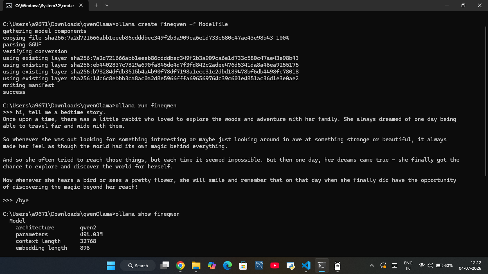

# Qwen-0.5B finetuned

A fine tuned version of **Qwen2.5-0.5B-Instruct** trained on the **tatsu-lab/alpaca** instruction dataset using **Unsloth**. This project was created as a hands on learning experience to understand the complete Large Language Model fine tuning pipeline, from instruction tuning to deployment.

## Project Highlights

* Fine tuned **Qwen2.5-0.5B-Instruct** using LoRA
* Trained on the **tatsu-lab/alpaca** instruction dataset
* LoRA adapter merged into the base model
* Converted to **GGUF** format
* Quantized using **Q4_K_M**
* Supports fast local inference with **Ollama**
* Deployed on **Hugging Face Spaces**
* Published on **Hugging Face Hub**

---

## Model Information

| Property              | Value                 |
| --------------------- | --------------------- |
| Base Model            | Qwen2.5-0.5B-Instruct |
| Fine Tuning Framework | Unsloth               |
| Dataset               | tatsu-lab/alpaca      |
| Epochs                | 2                     |
| Learning Rate         | 2e-5                  |
| Fine Tuning Method    | LoRA                  |
| Quantization          | Q4_K_M                |
| Output Format         | GGUF                  |
| Purpose               | Chat Assistant        |
| License               | Apache 2.0            |

---

## Training Pipeline

The workflow followed for this project:

1. Load the base Qwen2.5-0.5B-Instruct model.
2. Apply LoRA using Unsloth.
3. Fine tune on the Alpaca instruction dataset.
4. Merge the LoRA adapter into the base model.
5. Export the merged model.
6. Convert the model to GGUF.
7. Run the model locally using Ollama.
8. Deploy an interactive demo on Hugging Face Spaces.

---

## GGUF Model

The released GGUF model is:

```text
Qwen2.5-0.5B-Instruct.Q4_K_M.gguf
```

The **Q4_K_M** quantization provides a good balance between model size, response quality, and inference speed.

---

## Running with Ollama

Create a `Modelfile` that references the GGUF model.

Example:

```text
FROM ./Qwen2.5-0.5B-Instruct.Q4_K_M.gguf
```

Create the model:

```bash
ollama create qwen-alpaca -f Modelfile
```

Run the model:

```bash
ollama run qwen-alpaca
```

### Demo

The model was successfully tested locally using Ollama.



---

## Hugging Face

### Model

https://huggingface.co/ciphermosaic/qwen-alpaca-gguf

### Live Demo

https://huggingface.co/spaces/ciphermosaic/qwen-alpaca-chat

---

## Example

### Prompt

```text
Explain machine learning in simple words.
```

### Response

```text
Machine learning is a type of artificial intelligence that allows computers to learn patterns from data instead of being explicitly programmed. As the model sees more examples, it improves its ability to make predictions or decisions.
```

---

## Project Structure

```text
.
├── README.md
├── Modelfile
├── Qwen2.5-0.5B-Instruct.Q4_K_M.gguf
├── app.py
├── requirements.txt
└── images/
    └── ollama-demo.png
```

---

## Limitations

* Trained for only two epochs.
* No quantitative evaluation metrics were collected.
* May generate incorrect or hallucinated responses.
* Intended for educational and learning purposes.
* Not recommended for production or safety critical applications.

---

## Learning Outcomes

This project helped me gain practical experience with:

* Instruction fine tuning
* LoRA
* Parameter efficient training
* Model merging
* GGUF conversion
* Quantization
* Local inference using Ollama
* Hugging Face Hub
* Hugging Face Spaces deployment

---

## Acknowledgements

* Qwen Team for the Qwen2.5 base model
* Unsloth for efficient fine tuning
* tatsu-lab for the Alpaca dataset
* Ollama for local inference
* Hugging Face for model hosting and deployment

---

## License

This project is released under the Apache 2.0 License.
